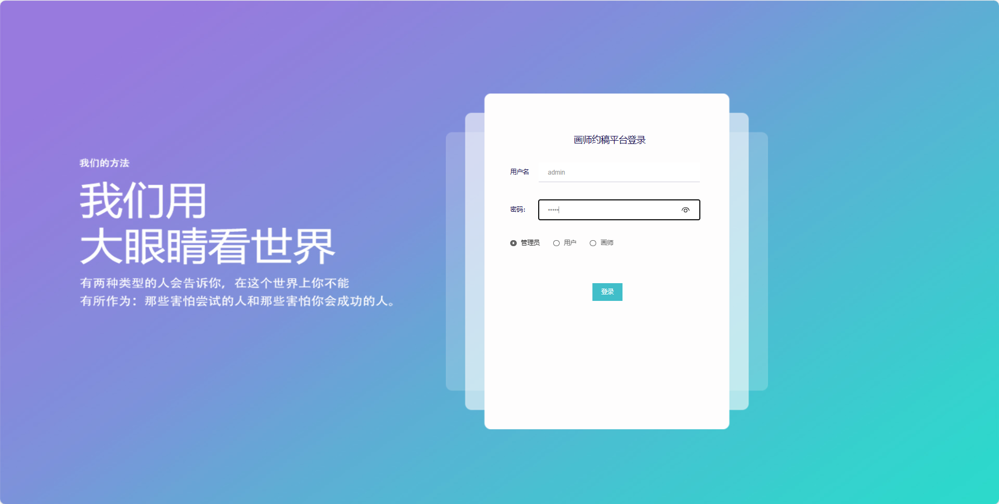
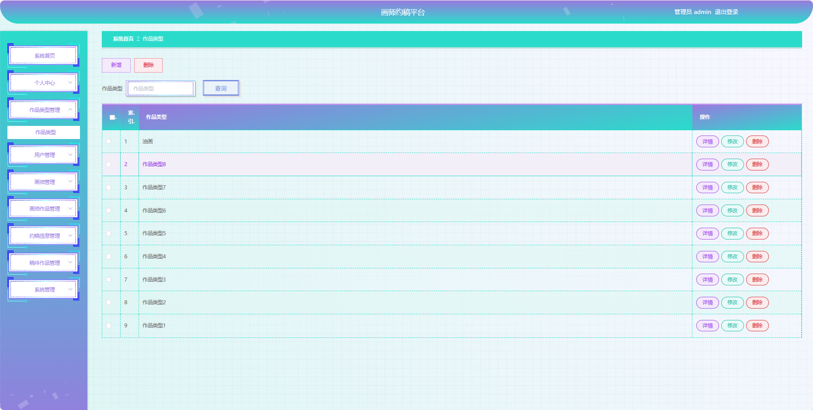
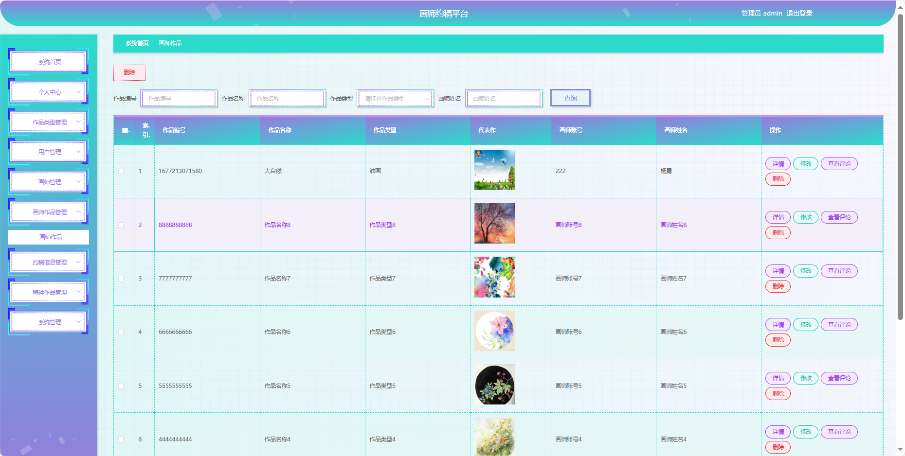
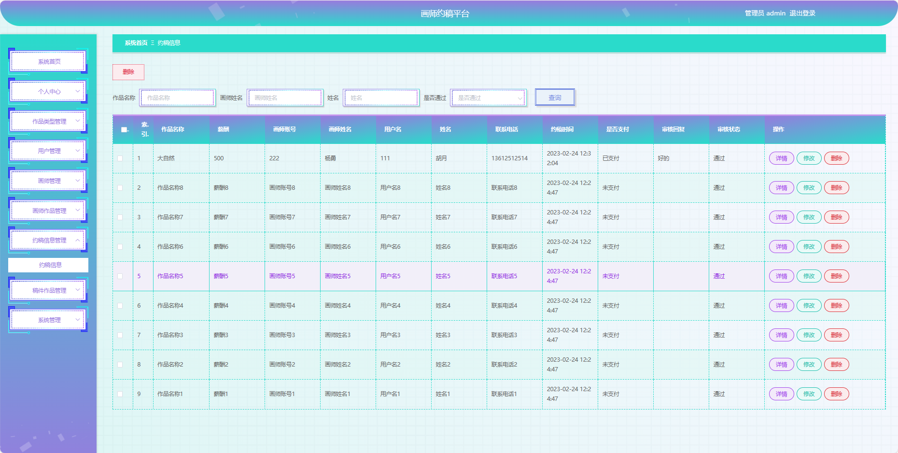
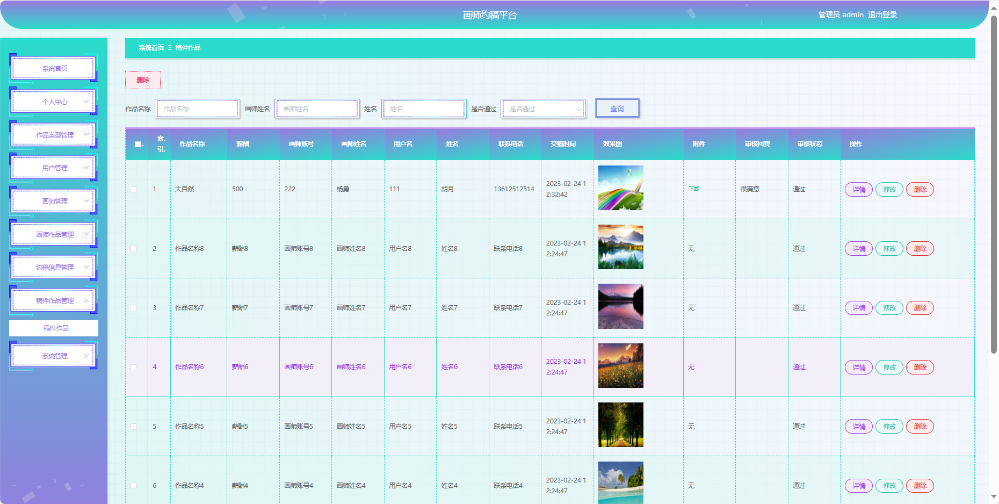
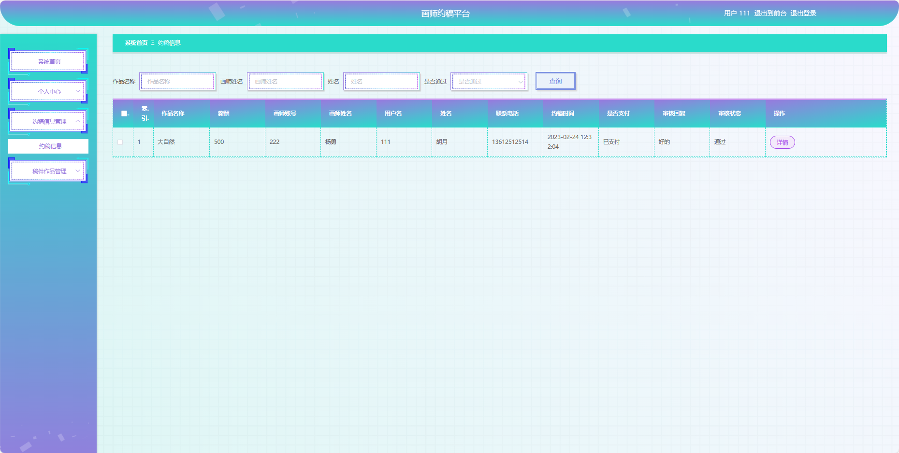
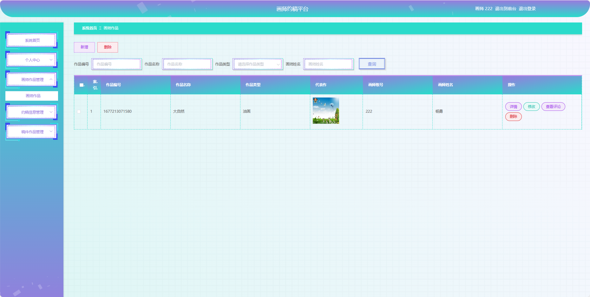
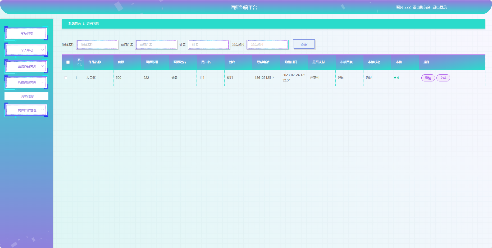

基于Springboot的画师约稿平台（程序+论文）
=
### 完整代码获取地址：从戎源码网 ([https://armycodes.com/](https://armycodes.com/))
### 作者微信：19941326836  QQ：952045282 
### 承接计算机毕业设计、Java毕业设计、Python毕业设计、深度学习、机器学习
### 选题+开题报告+任务书+程序定制+安装调试+论文+答辩ppt 一条龙服务
### 所有选题地址https://github.com/nature924/allProject

一、项目介绍
---
基于Spring Boot框架实现的画师约稿平台，系统包含三种角色：管理员、用户，画师，主要功能如下
### 【管理员后台功能】

1. 系统首页：提供管理员进入后台管理的入口。
2. 个人中心：管理员可以管理个人信息。
3. 作品类型管理：维护系统中的作品类型信息。
4. 用户管理：查看、编辑、冻结或删除用户账号。
5. 画师管理：管理画师信息。
6. 画师作品管理：查看、编辑、删除画师上传的作品信息。
7. 约稿信息管理：记录用户对画师的约稿需求。
8. 稿件作品管理：管理用户提交的稿件作品。
9. 系统管理：包括系统的基本设置。

### 【用户后台功能】

1. 系统首页：提供用户进入后台管理的入口。
2. 个人中心：用户可以管理个人信息。
3. 约稿信息管理：用户可以查看自己发布的约稿信息。
4. 稿件作品管理：用户可以查看和管理自己提交的稿件作品。

### 【画师后台功能】

1. 系统首页：提供画师进入后台管理的入口。
2. 个人中心：画师可以管理个人信息等。
3. 画师作品管理：查看、编辑、删除自己上传的作品信息。
4. 约稿信息管理：画师可以查看约稿信息。
5. 稿件作品管理：画师可以管理自己提交的稿件作品。

二、项目技术
---
- 编程语言：Java
- 数据库：MySQL
- 项目管理工具：Maven
- 前端技术：VUE、HTML、Jquery、Bootstrap
- 后端技术：Spring、SpringMVC、MyBatis

三、运行环境
---
- 操作系统：Windows、macOS都可以
- JDK版本：JDK1.8以上都可以
- 开发工具：IDEA、Ecplise、Myecplise都可以
- 数据库: MySQL5.7以上都可以
- Tomcat：任意版本都可以
- Maven：任意版本都可以

四、运行截图
---
### 论文截图：

### 程序截图：

